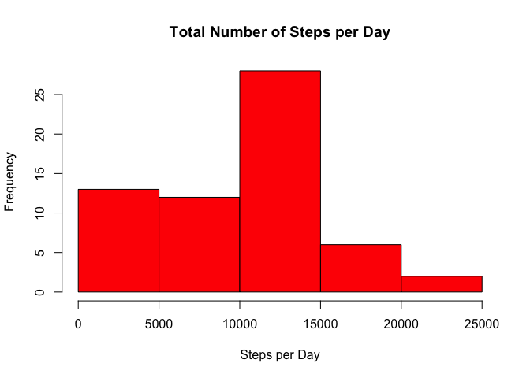
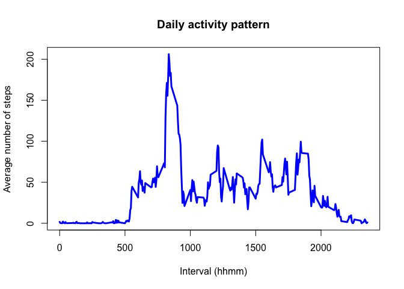
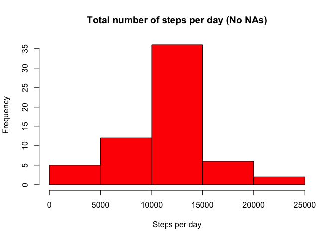
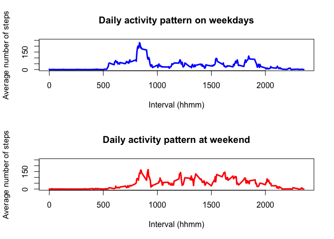

# Reproducible Research: Peer Assessment 1
Christopher Young  
March 14, 2015  

This R Mardown document is intended to fulfill all of the requiremments of peer-graded assignment 1 ( week 2) of the John Hopkins Reproducible Research course offered on Coursera. 

This is the original work of Christopher Young. 

# Loading and preprocessing the data

The first section will deal with loading and procesing the data. It is assumed that the original dataset available [here](https://d396qusza40orc.cloudfront.net/repdata%2Fdata%2Factivity.zip) has been downloade and unzipped into the same folder as this R Markdown document. For this reason, there should be no requirement to set the working directory at any point of this analysis.

We will first use the *read.csv* function to load the activity.csv file from the current working directory.
We will also display the basic structure of this dataset to ensure it was loaded properly.


```r
step_data <- read.csv("activity.csv", stringsAsFactors = FALSE)
str(step_data)
```

```
## 'data.frame':	17568 obs. of  3 variables:
##  $ steps   : int  NA NA NA NA NA NA NA NA NA NA ...
##  $ date    : chr  "2012-10-01" "2012-10-01" "2012-10-01" "2012-10-01" ...
##  $ interval: int  0 5 10 15 20 25 30 35 40 45 ...
```


# What is mean total number of steps taken per day?
In this section, we will perform the steps required to calculate the mean total steps taken per day.

We will first load the required libraries to perform the rest of this analysis. The required libraries are

* dplyr
* lubridate
* tidyr
* lattice


This section of code will load all libraries required for the rest of the code in this document

```r
library(dplyr)
```

```
## 
## Attaching package: 'dplyr'
## 
## The following object is masked from 'package:stats':
## 
##     filter
## 
## The following objects are masked from 'package:base':
## 
##     intersect, setdiff, setequal, union
```

```r
library(lubridate)
library(tidyr)
library(lattice)
```

We will use the dplyr *group_by* function to group step samples together using the values in the data column. We will then us the dplyr *summarize* function to calculate the *mean* of the step column and assign it to the variable *step_data_mean_by_day*. 


```r
step_data_by_day <- group_by(step_data, date) #use dplyr\group_by function to group step samples together by the date
summarise_step_data_mean_by_day <- summarize(step_data_by_day, mean(steps, na.rm = TRUE)) #use dplyr\summarise function to calculate mean of the steps column
colnames(summarise_step_data_mean_by_day) <- c("date", "step_means") #use cbind function to label the step means
```

The mean of the total number of steps per day is:

*This data set includes NAs. Some days may not show values*


```r
summarise_step_data_mean_by_day
```

```
## Source: local data frame [61 x 2]
## 
##          date step_means
## 1  2012-10-01        NaN
## 2  2012-10-02    0.43750
## 3  2012-10-03   39.41667
## 4  2012-10-04   42.06944
## 5  2012-10-05   46.15972
## 6  2012-10-06   53.54167
## 7  2012-10-07   38.24653
## 8  2012-10-08        NaN
## 9  2012-10-09   44.48264
## 10 2012-10-10   34.37500
## ..        ...        ...
```

#Calculate the total number of Steps taken per day

In this section we will calculate the total number of steps taken per day. 

We will use the dply *group_by* function to group step samples together by the day they were taken.

Once the grouping is accomplished, we will then us the dplyr *summarize* function to create a *sum* of each individual day. 


```r
step_data_by_day <- group_by(step_data, date) #use dplyr\group_by function to group step samples together by the date
summarise_step_data_sum_by_day <- summarize(step_data_by_day, sum(steps, na.rm = TRUE)) #use dplyr\summarise function to calculate mean of the steps column
colnames(summarise_step_data_sum_by_day) <- c("date", "step_sum") #use cbind function to label the step means
```

The summary of the sum of the total number of steps taken per day is:

*This data set includes NAs. Some days may not show values*


```r
summarise_step_data_sum_by_day
```

```
## Source: local data frame [61 x 2]
## 
##          date step_sum
## 1  2012-10-01        0
## 2  2012-10-02      126
## 3  2012-10-03    11352
## 4  2012-10-04    12116
## 5  2012-10-05    13294
## 6  2012-10-06    15420
## 7  2012-10-07    11015
## 8  2012-10-08        0
## 9  2012-10-09    12811
## 10 2012-10-10     9900
## ..        ...      ...
```

##Make a histogram of the total number of steps take each day

In this section, we will create a histogram of the Total Number of Steps per Day calculated above. 

*Thanks to Rblogger [Basics of Histogram](http://www.r-bloggers.com/basics-of-histograms/) blog for help with this section.*


```r
hist(summarise_step_data_sum_by_day$step_sum, main = "Total Number of Steps per Day", xlab = "Steps per Day", ylab = "Frequency", col="Red")
```

 

##Calculate and report the mean and median of the total number of steps taken per day

In this section we will calculate the mean and median if the total number of steps taken per day.

**Calculate Mean**

We we will apply the *mean* function against the *summarise_step_data_sum_by_day$steps_sum* data calculated above to calculate the mean of the total number of steps per day.

```r
mean_steps_per_day <- mean(summarise_step_data_sum_by_day$step_sum)
```

The mean of the total number of steps per day is 9354

**Calculate Median**

We we will apply the *median* function against the *summarise_step_data_sum_by_day$steps_sum* data calculated above to calculate the median of the total number of steps per day.


```r
median_steps_per_day <- median(summarise_step_data_sum_by_day$step_sum)
```

The median of the total number of steps per day is 1.0395\times 10^{4}

# What is the average daily activity pattern?

In this section we will analyse the daily activity patterns. We will

1. Create a 5 Min interval Time Series Plot of the Step Data 
2. Identify which 5 Min Interval has the Max Steps


##Create 5Min Time Series Plot
Make a time series plot (i.e type = 'l') of the 5-minute interval (x-axis) and the average of steps taken, averaged across all days. (y-axis)

Use the dplyr *transform* function to transform the *step_data_by_day* data created above. 
Use the dplyr *group_by* function to group the *step_data_by_day* by the interval column.
Use the dplyr *summarize* function to calculate the mean number of steps across all days.

```r
step_data_by_day <- transform(step_data_by_day, interval = factor(interval))
step_data_by_day <- group_by(step_data_by_day, interval)
mean_steps_interval <- summarise(step_data_by_day, steps = mean(steps, na.rm=TRUE))
```


Use the *mean_steps_interval$interval* column from the *mean_steps_interval* created above to plot the averaged steps per interval:

```r
plot(levels(as.factor(mean_steps_interval$interval)), mean_steps_interval$steps, 
     type="l", col="blue", lwd=3, 
     main="Daily activity pattern", 
     xlab="Interval (hhmm)", ylab="Average number of steps")
```

 

##Which 5-minute interval, on average across all the days in the dataset, contains the maximum number of steps

Calculate the 5-minute interval, on average across all the days in the dataset, contains the maximum number of steps.

We use *match(max(mean_steps_interval$steps), mean_steps_interval$steps)* function as the selector to identify the location of the reported 5-Min interval which has the maximum amount of steps in the given data set. 


```r
max_steps<-mean_steps_interval[match(max(mean_steps_interval$steps),mean_steps_interval$steps),]
```
The interval located in row 104, which is interval 835 contains contains the max-steps-value on average across all the days which is 206

# Inputing missing values

In this section we will replace the NA values in the steps column of the original dataset. 
We will

* Calculate the total number of missing values in the dataset
* Create a new dataset with the NA values filled by the mean steps.

##Calculate and report the total number of missing values in the dataset (i.e. the total number of rows with NAs)

In this section we will use the *sum* function to calculate the total number of missing values, as identified using the *ia.na* function from the original dataset.


```r
number_na<-sum(is.na(step_data))
```

The number of missing values in the data set is 2304

##Devise a strategy for filling in all of the missing values in the dataset.
The strategy does not need to be sophisticated. For example, you could use the mean/median for that day, or the mean for that 5-minute interval, etc.


##Create a new dataset that is equal to the original dataset but with the missing data filled in.

In this section, we will reload the original dataset from the original activity.csv file into a new variable labeled step_data_NoNAs


```r
step_data_NoNAs<-read.csv("activity.csv" )
```

Create a new dataset that is equal to the original dataset but with the missing data filled in.

```r
i<-1
for (i in 1:dim(step_data_NoNAs)[1]){
        if (is.na(step_data_NoNAs[i,1])){
                r<-match(step_data_NoNAs[i,3],mean_steps_interval$interval)
                step_data_NoNAs[i,1]<-mean_steps_interval[r,2]
                }
        i=i+1
} 
```
##Make a histogram of the total number of steps taken each day

This histogram shows the total number of steps taken each day.


```r
sum_steps_day_noNAs <- tapply(step_data_NoNAs$steps, step_data_NoNAs$date, sum, na.rm = TRUE)
hist(sum_steps_day_noNAs, main = "Total number of steps per day (No NAs)", 
    xlab = "Steps per day", ylab = "Frequency"
    ,col="red")
```

 

##Calculate and report the mean and median total number of steps taken per day. 

```r
mean_noNAs<-mean(sum_steps_day_noNAs)
print(paste("Mean:", mean_noNAs), sep = " ")
```

```
## [1] "Mean: 10766.1886792453"
```

```r
median_noNAs<-median(sum_steps_day_noNAs)
print(paste("Median:", median_noNAs), sep = " ")
```

```
## [1] "Median: 10766.1886792453"
```

The mean of steps taken per day is 1.0766\times 10^{4}.
The median of steps taken is 1.0766\times 10^{4}. 

##Do these values differ from the estimates from the first part of the assignment? What is the impact of imputing missing data on the estimates of the total daily number of steps?

|  Calculation |  With NAs   |  No NAs      |
|-------------:|------------:|-------------:|
|     Mean     |          9354|   10766|
|     Median   |        10395 |           10766|


The Mean and median value changed compared to the first calculation where the NAs in the Steps column were not cleaned from the data set. Since the NA values in the Steps column were substituted with the calculated mean values the mean and median both changed slightly. Interestingly, the median and mean of the NoNAs data set became the same value.


#Are there differences in activity patterns between weekdays and weekends?
For this part the weekdays() function may be of some help here. Use the dataset with the filled-in missing values for this part.


##Create New Factor Indicating Type of Day

Create a new factor variable in the dataset with two levels – “weekday” and “weekend” indicating whether a given date is a weekday or weekend day.

In this section we will use the dplyr mutate and the lubridate wday function to add a column date_day to the step_data_NoNAs dataset. 

```r
step_data_NoNAs<- mutate(step_data_NoNAs, date_day=wday(date))
step_data_weekday<-subset(step_data_NoNAs,date_day>1 & date_day<7)
step_data_weekday <- transform(step_data_weekday, interval = factor(interval))
step_data_weekday<-group_by(step_data_weekday,interval)
mean_steps_interval_weekday <- summarise(step_data_weekday, steps = mean(steps,na.rm=TRUE))

step_data_weekend<-subset(step_data_NoNAs,date_day==1 | date_day==7)
step_data_weekend <- transform(step_data_weekend, interval = factor(interval))
step_data_weekend<-group_by(step_data_weekend,interval)
mean_steps_interval_weekend <- summarise(step_data_weekend, steps = mean(steps,na.rm=TRUE))
```
##Create 5-Min Plot of Average Steps Taken Acrosss Weekday or Weekend.

Make a panel plot containing a time series plot (i.e. type = "l") of the 5-minute interval (x-axis) and the average number of steps taken, averaged across all weekday days or weekend days (y-axis). See the README file in the GitHub repository to see an example of what this plot should look like using simulated data.

```r
par(mfrow = c(2, 1))
plot(levels(as.factor(mean_steps_interval_weekday$interval)), mean_steps_interval_weekday$steps, 
     type="l", col="blue", lwd=3, ylim=c(0,250),
     main="Daily activity pattern on weekdays", 
     xlab="Interval (hhmm)", ylab="Average number of steps")

plot(levels(as.factor(mean_steps_interval_weekend$interval)), mean_steps_interval_weekend$steps, 
     type="l", col="red", lwd=3, ylim=c(0,250),
     main="Daily activity pattern at weekend",
     xlab="Interval (hhmm)", ylab="Average number of steps")
```

 

Although the first portion of the day appears to be similar between the weekday and weekend samples, there appears to be slight more activity, on average, during the mid-day samples as shown in the weekend plot.
